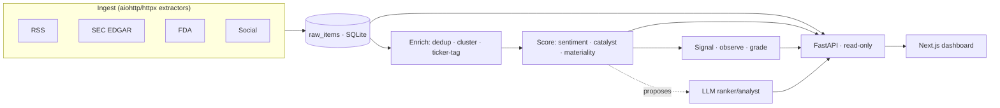

# Financial News Screener

A real-time financial-news intelligence dashboard. It ingests market news from RSS,
SEC EDGAR, FDA, and social feeds; deduplicates and clusters headlines; scores each
cluster for **sentiment** and **catalyst type** (M&A, earnings, FDA, guidance, …);
and surfaces the result as a live tape, a Finviz-style fundamentals screener, a
catalyst board, and a paper-trading simulation — with an optional LLM agent layer
that proposes (never executes) a cited watchlist.

The whole spine is **deterministic and idempotent**: every sweep can crash and
re-run safely, predictions mature on their real horizon (no lookahead), and the
signal path never depends on the LLM.

> **Built iteratively with AI assistance.** This project was developed hands-on with
> AI pair-programming (Claude) across design, implementation, and review. The
> architecture decisions, invariants, and tests are deliberate and human-owned; the
> AI accelerated the writing of them. Where the code enforces something subtle (an
> append-only trigger, a no-lookahead grading rule), a comment says why.

## What's inside

| Page | What it shows |
|------|---------------|
| **Home** (`/`) | Live news tape (RSS/SEC/FDA/social), morning premarket panel, day calendar |
| **Screener** (`/screener`) | Signal-ranked tickers with numeric VOL / market-cap columns + a filter bar |
| **Universe** (`/universe`) | Finviz-style fundamentals screen over the tradeable universe |
| **Catalysts** (`/catalysts`) | FIRED (24h/48h/1W), scheduled, and premarket catalyst boards |
| **Ticker** (`/ticker/[t]`) | Price + intraday bars, news-density curve, cluster history, sim bars |
| **Rank** (`/rank`) | LLM ranker proposals (force-run, model-selectable) + spend accounting |
| **Ledger / Eval / Config** | Paper-trade ledger, prediction grading (IC/CAR), versioned config with approvals |

## Architecture at a glance



A two-speed loop drives it: a **fast** deterministic sweep (ingest → enrich → score →
signal) every couple of minutes for freshness, and a **full** sweep (baselines,
grading, attention rollup) on a slower cadence. See
[`docs/ARCHITECTURE.md`](docs/ARCHITECTURE.md) for the data flow and the load-bearing
invariants.

## Tech stack

- **Backend/pipeline** — Python 3.12, SQLAlchemy 2.0 over **SQLite** (WAL + append-only
  triggers), FastAPI + Uvicorn for the read-only API.
- **Frontend** — Next.js 14 (App Router), React 18, TypeScript, Tailwind,
  lightweight-charts.
- **Data** — RSS/SEC/FDA/social ingestion, Alpaca (bars + paper sim), Finviz/Nasdaq
  (universe), FinBERT or a Loughran-McDonald lexicon for sentiment.
- **Agents (optional)** — Anthropic API *or* a Claude subscription via the Agent SDK.

## Quickstart (local)

Prerequisites: Python 3.12+, Node 18+, git.

```bash
# 1. Backend deps (editable install of the `pipeline` package + runtime deps)
python -m venv .venv && source .venv/bin/activate   # Windows: .venv\Scripts\activate
pip install -e ".[dev]"

# 2. Config — copy the template from docs/ENVIRONMENT.md into .env (all keys optional)
#    The stack boots with an empty .env; add keys to switch features on.

# 3. Initialize the database (tables + append-only triggers)
python scripts/init_db.py

# 4. Seed entities + universe, then run the pipeline once (or as a loop)
python scripts/seed_entities.py
python scripts/snapshot_universe.py
python scripts/run_pipeline.py --once --no-finbert      # one sweep; drop --once to loop

# 5. Serve the API (defaults to 127.0.0.1:8001)
python scripts/serve_api.py

# 6. Frontend (separate shell)
cd frontend && npm install
#   point the UI at the API:
echo 'NEXT_PUBLIC_API_URL=http://localhost:8001'            >  .env.local
echo 'NEXT_PUBLIC_PREDICTION_API_URL=http://localhost:8001' >> .env.local
npm run dev      # http://localhost:3000
```

FinBERT needs ~440 MB RAM; `--no-finbert` scores with the lexicon only (low-RAM,
CI, and small deploy instances).

## Deploy to Railway

Two services from this one repo, sharing nothing but the public API URL. The app
service colocates the pipeline loop and the API over a **SQLite volume** (the schema
uses SQLite-specific triggers and upserts, so a volume beats a Postgres port); the
frontend is a standalone Next.js service.

**1 — App service (API + pipeline)**
1. New Project → **Deploy from GitHub repo** → pick this repo.
2. Service **Settings → Root Directory** = `/` (repo root). The root
   [`railway.json`](railway.json) sets the Nixpacks build, the start command
   (`bash scripts/railway_start.sh`), and the `/health` healthcheck.
3. **Settings → Volumes → Add Volume**, mount path `/data`.
4. **Variables**: `DATABASE_URL=sqlite:////data/pipeline.db` (four slashes = absolute,
   on the volume). Add any optional keys from
   [`docs/ENVIRONMENT.md`](docs/ENVIRONMENT.md) (`ANTHROPIC_API_KEY`, `ALPACA_*`, …).
   `PORT`/`HOST` are injected automatically.
5. Deploy. On boot the start script runs `init_db` → seeds entities/universe in the
   background → starts the pipeline loop, and serves the API in the foreground.

**2 — Frontend service (Next.js)**
1. In the same project → **New → GitHub repo** (same repo) → a second service.
2. **Settings → Root Directory** = `/frontend`. [`frontend/railway.json`](frontend/railway.json)
   handles build + `npm run start`.
3. **Variables** (⚠ baked at **build** time, so set them before the first build):
   `NEXT_PUBLIC_API_URL` and `NEXT_PUBLIC_PREDICTION_API_URL` = the app service's
   public URL (Settings → Networking → **Generate Domain** on the app service first).
4. Deploy, then open the frontend's generated domain.

> Single instance by design: SSE fan-out runs in-process (no Redis needed) and the
> pipeline is one background worker. The API stays up if the worker hiccups; Railway
> restarts the container only if the foreground API exits.

## Testing

```bash
pytest                 # full suite (network-marked tests are excluded by default)
```

## Repository layout

```
src/pipeline/      ingest · enrich · score · signal · grade · aggregate · agents · api · sim
backend/           legacy RSS/SEC/social extractors the pipeline dispatches into
frontend/          Next.js dashboard
scripts/           runnable entrypoints (init_db, run_pipeline, serve_api, railway_start.sh, …)
configs/           YAML: universe, catalysts, presets, source tiers, aliases, watchlist
tests/             unit + integration (SQLite fixtures, no network)
docs/              ARCHITECTURE.md · ENVIRONMENT.md
```

## License

See [LICENSE](LICENSE).
