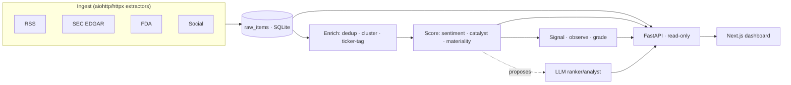

# Financial News Screener

A real-time financial-news intelligence dashboard. It ingests market news from RSS,
SEC EDGAR, FDA, and social feeds; deduplicates and clusters headlines; scores each
cluster for **sentiment** and **catalyst type** (M&A, earnings, FDA, guidance, …);
and surfaces the result as a live tape, a Finviz-style fundamentals screener, a
catalyst board, and a paper-trading simulation — with an optional LLM agent layer
that proposes (never executes) a cited watchlist.

The whole spine is **deterministic and idempotent**: every sweep can crash and
re-run safely, predictions mature on their real horizon (no lookahead), and the
signal path never depends on the LLM.

> **Built iteratively with AI assistance.** This project was developed hands-on with
> AI pair-programming (Claude) across design, implementation, and review. The
> architecture decisions, invariants, and tests are deliberate and human-owned; the
> AI accelerated the writing of them. Where the code enforces something subtle (an
> append-only trigger, a no-lookahead grading rule), a comment says why.

## What's inside

| Page | What it shows |
|------|---------------|
| **Home** (`/`) | Live news tape (RSS/SEC/FDA/social), morning premarket panel with a LIVE / past-date selector, day calendar |
| **Screener** (`/screener`) | Signal-ranked tickers with numeric VOL / market-cap columns + a filter bar |
| **Universe** (`/universe`) | Finviz-style fundamentals screen over the tradeable universe |
| **Catalysts** (`/catalysts`) | FIRED (24h/48h/1W), scheduled, and a live premarket morning-catalyst panel |
| **Ticker** (`/ticker/[t]`) | Price + intraday bars, news-density + attention charts, cluster history, sim bars, this account's entry/exit fill markers |
| **Trader** (`/trader`) | **Read-only** paper-account dashboard: account header + equity curve, positions & FIFO round-trip blotter each joined to the originating catalyst headline (provenance), P&L calendar + day report cards, a catalyst watchlist, and driver-liveness |
| **Rank** (`/rank`) | LLM ranker proposals (force-run, model-selectable) + spend accounting |
| **Ledger / Eval / Config** | Prediction ledger with origin-news lanes (structured/social) and a reals-vs-baselines toggle, prediction grading (IC/CAR), versioned config with approvals |

### Notable features

- **TRADER panel** — a strictly read-only web view of the Alpaca **paper** book. Every closed round-trip is FIFO-paired from real fills and joined back to the sim trade → cluster → origin headline, so the blotter answers "the agent bought AAPL at 9:47 — *here's the headline that caused it*." Keys never reach the browser.
- **Autonomous cloud driver + exit-policy A/B** — an optional standing driver (off by default) arms one paper session per trading day off the Alpaca clock and runs enabled configs, including a live A/B of a `vol_stop` exit against the `horizon_hold` baseline. Order placement lives only in the driver's clock loop; no HTTP route can trade.
- **LEDGER origin-news + baselines** — every prediction carries its originating source_class / headline / url via a companion table; the ledger defaults to real signals with a one-click **BASELINES** toggle for the always_up/random/momentum shadows.
- **Accessibility** — a WCAG 2.1 AA axe harness (`npm run a11y`) scans every route; the audited terminal went **462 → 0** critical+serious violations (see [`docs/ada_compliance.md`](docs/ada_compliance.md)).
- **Ingestion roster** — RSS wires (Bloomberg, CNBC, MarketWatch, Seeking Alpha, PR Newswire, GlobeNewswire, Nasdaq, **IBKR Traders' Insight**, …), SEC EDGAR + FDA extractors, and social lanes (Reddit multi-subreddit + Bluesky firehose). StockTwits has been retired.
- **~500 tests** (unit + integration, SQLite fixtures, no network) guard the invariants.

## Architecture at a glance



A two-speed loop drives it: a **fast** deterministic sweep (ingest → enrich → score →
signal) every couple of minutes for freshness, and a **full** sweep (baselines,
grading, attention rollup) on a slower cadence. See
[`docs/ARCHITECTURE.md`](docs/ARCHITECTURE.md) for the data flow and the load-bearing
invariants.

## Tech stack

- **Backend/pipeline** — Python 3.12, SQLAlchemy 2.0 over **SQLite** (WAL + append-only
  triggers), FastAPI + Uvicorn for the read-only API.
- **Frontend** — Next.js 14 (App Router), React 18, TypeScript, Tailwind,
  lightweight-charts.
- **Data** — RSS/SEC/FDA/social ingestion, Alpaca (bars + paper sim), Finviz/Nasdaq
  (universe), FinBERT or a Loughran-McDonald lexicon for sentiment.
- **Agents (optional)** — Anthropic API *or* a Claude subscription via the Agent SDK.

## Quickstart (local)

Prerequisites: Python 3.12+, Node 18+, git.

```bash
# 1. Backend deps (editable install of the `pipeline` package + runtime deps)
python -m venv .venv && source .venv/bin/activate   # Windows: .venv\Scripts\activate
pip install -e ".[dev]"

# 2. Config — copy the template from docs/ENVIRONMENT.md into .env (all keys optional)
#    The stack boots with an empty .env; add keys to switch features on.

# 3. Initialize the database (tables + append-only triggers)
python scripts/init_db.py

# 4. Seed entities + universe, then run the pipeline once (or as a loop)
python scripts/seed_entities.py
python scripts/snapshot_universe.py
python scripts/run_pipeline.py --once --no-finbert      # one sweep; drop --once to loop

# 5. Serve the API (defaults to 127.0.0.1:8001)
python scripts/serve_api.py

# 6. Frontend (separate shell)
cd frontend && npm install
#   point the UI at the API:
echo 'NEXT_PUBLIC_API_URL=http://localhost:8001'            >  .env.local
echo 'NEXT_PUBLIC_PREDICTION_API_URL=http://localhost:8001' >> .env.local
npm run dev      # http://localhost:3000
```

FinBERT needs ~440 MB RAM; `--no-finbert` scores with the lexicon only (low-RAM,
CI, and small deploy instances).

> The frontend defaults to the **localhost:8001** API with no env at all
> (`frontend/src/lib/config.ts`) — the `.env.local` lines above are only needed to
> point it at a *different* backend.

### Windows: one-command dev (`start.ps1`)

On Windows there's a launcher at the repo root that brings the whole stack up in
three supervised windows (API + pipeline + frontend), each restart-on-crash and
teeing to `logs\<svc>_<date>.log`.

```powershell
# one-time setup
python -m venv .venv
.\.venv\Scripts\python -m pip install -r requirements.txt
cd frontend; npm install; cd ..
# optional: copy the docs/ENVIRONMENT.md template block to .env to enable
# Alpaca / LLM / onnx. The stack runs fine with NO .env (SQLite + lexicon).

# launch
.\start.ps1                 # API (:8001) + pipeline (lexicon) + frontend (:3000)
.\start.ps1 -FinBERT        # score with FinBERT instead of the lexicon
.\start.ps1 -Trader         # ALSO run the local paper driver (see the warning below)
.\start.ps1 -Stop           # stop whatever start.ps1 launched
```

Then open:

- **http://localhost:3000** — the dashboard
- **http://127.0.0.1:8001/health** — API health (scoring / mount / driver blocks)
- **http://127.0.0.1:8001/docs** — API docs

It runs preflight checks first (venv, `frontend/node_modules`, a soft `.env`
warning, and port-in-use warnings for 8001/3000) and prints the create/install
commands if anything's missing.

**Sentiment mode locally:** the pipeline defaults to the zero-dependency **Loughran–McDonald
lexicon** (no ML stack, low RAM). To upgrade: (a) set `SENTIMENT_MODE=onnx` in
`.env` and download the quantized model once with
[`scripts/fetch_model.py`](scripts/fetch_model.py), then `.\start.ps1 -FinBERT`; or
(b) install the ML stack (`pip install torch transformers`) and run
`.\start.ps1 -FinBERT` for native torch FinBERT.

> **⚠ One driver per Alpaca account.** `-Trader` launches the local paper driver.
> The **cloud** driver on Railway is live for the shared paper account — running a
> second driver against the **same** account double-places orders. Only use
> `-Trader` if this machine's `ALPACA_*` keys point at an account no other driver is
> trading. Without `-Trader` (the default) the local stack is strictly read-only
> toward Alpaca.

## Deploy to Railway

Two services from this one repo, sharing nothing but the public API URL. The app
service colocates the pipeline loop and the API over a **SQLite volume** (the schema
uses SQLite-specific triggers and upserts, so a volume beats a Postgres port); the
frontend is a standalone Next.js service.

**1 — App service (API + pipeline)**
1. New Project → **Deploy from GitHub repo** → pick this repo.
2. Service **Settings → Root Directory** = `/` (repo root). The root
   [`railway.json`](railway.json) sets the Nixpacks build, the start command
   (`bash scripts/railway_start.sh`), and the `/health` healthcheck.
3. **Settings → Volumes → Add Volume**, mount path **`/app/data`** (the service
   runs with the repo root as its working directory, so the DB lands on the volume).
4. **Variables**: `DATABASE_URL=sqlite:////app/data/pipeline.db` (four slashes =
   absolute path on the volume). Add any optional keys from
   [`docs/ENVIRONMENT.md`](docs/ENVIRONMENT.md) (`ANTHROPIC_API_KEY`, `ALPACA_*`, …).
   `PORT`/`HOST` are injected automatically; Railway also injects
   `RAILWAY_VOLUME_MOUNT_PATH`, which the volume guard cross-checks.
   - **TRADER view (paper account):** set `ALPACA_API_KEY` and `ALPACA_API_SECRET`
     (names only — paste your **paper** account values in the Railway UI, never in
     git) on **this app service**. They power the read-only `/trader/*` endpoints
     (account, positions, portfolio history, blotter) as well as the price-bar /
     sim paths. Without them the deployed TRADER tab renders a "connect Alpaca
     keys" empty state instead of crashing. All Alpaca access is paper-only and
     read-only in the web backend; keys never reach the browser.
5. Deploy. [`scripts/railway_start.sh`](scripts/railway_start.sh) is **API-first and
   supervised** (hardened after a boot-blocking incident): `serve_api` binds `$PORT`
   **first** so the `/health` healthcheck passes in seconds and cutovers complete
   cleanly; only then does a **bootstrap** phase run — wait-for-writable-volume →
   `init_db` → `hydrate_seed` → assign exit policies → fetch model → seed
   entities/universe — each step under a **hard timeout** with isolated failure
   (a hung step is killed and boot continues). Finally the **workers** (pipeline,
   and the driver if enabled) launch **supervised**: a worker that dies is relaunched
   with capped backoff and a loud `[boot]` line — never silently. Every stage prints
   a `[boot]` marker.

> **Demo history is seeded automatically, per table.**
> [`scripts/hydrate_seed.py`](scripts/hydrate_seed.py) copies `seed/pipeline_seed.db`
> (a slim extract — prediction ledger, graded outcomes, attention history, universe,
> paper-trading report cards; the bulk news archive is excluded and re-accumulates
> live) into the volume DB. Seeding is gated **per table on emptiness** — each table
> is filled only if it's empty, so a table that has since accumulated live rows is
> never clobbered, and a table added after the seed was built still fills on the next
> boot. Copy is column-name-matched (not positional), so it survives schema drift.
> Refresh the seed before a push with
> `python scripts/export_seed.py --source path/to/pipeline.db`.

> **Health = the operational source of truth.** `GET /health` returns, alongside
> ingest staleness, three diagnostic blocks: **scoring** (`sentiment_mode`, a FinBERT
> resolve/self-test, and `finbert_scores_recent` — nonzero proves FinBERT is actually
> producing scores, not silently degraded to the lexicon), **mount** (does the DB
> land on the mounted volume — answered from live `st_dev` truth, not trust), and the
> paper-**driver** liveness via `GET /trader/driver`.

**2 — Frontend service (Next.js)**
1. In the same project → **New → GitHub repo** (same repo) → a second service.
2. **Settings → Root Directory** = `/frontend`. [`frontend/railway.json`](frontend/railway.json)
   handles build + `npm run start`.
3. **Variables** (⚠ baked at **build** time, so set them before the first build):
   `NEXT_PUBLIC_API_URL` and `NEXT_PUBLIC_PREDICTION_API_URL` = the app service's
   public URL (Settings → Networking → **Generate Domain** on the app service first).
4. Deploy, then open the frontend's generated domain.

> Single instance by design: SSE fan-out runs in-process (no Redis needed) and the
> pipeline is one background worker. The API stays up if the worker hiccups; Railway
> restarts the container only if the foreground API exits.

### Optional: live paper trading on Railway (the standing driver)

By default the app service only serves the API + runs the news pipeline — it does
**not** trade. To let it place **paper** orders against Alpaca, set one flag on the
**app service**:

```
TRADER_DRIVER_ENABLED=true          # master switch — default off = no trading
ALPACA_API_KEY=<paper key id>       # PAPER account only (paper-api endpoint is hard-asserted)
ALPACA_API_SECRET=<paper secret>
# TRADER_DRIVER_SWEEP_S=60          # optional; seconds between entry/exit sweeps
```

With the flag on, [`scripts/railway_start.sh`](scripts/railway_start.sh) launches the
standing driver ([`scripts/run_trader.py`](scripts/run_trader.py)) as its own child
alongside the API: it arms one session per trading day off the **Alpaca clock**
(the container runs UTC — all ET logic comes from the exchange clock, never host
time), sweeps entries/exits, flattens ~10 min before the close, and writes
`sim_trades` / `sim_daily_summary` to the volume DB so the TRADER blotter, calendar,
and report cards populate end-to-end. It trades only configs you've enabled
(`POST /sim/configs/{id}/toggle`); with none enabled it runs but places nothing.

> **⚠ Exactly one driver may trade a paper account.** The driver acts on the real
> Alpaca book. If Railway is trading this account, the **local** driver for the same
> account MUST stay off, or the two will place duplicate/conflicting orders. The
> TRADER tab footer shows a red DOUBLE-DRIVER banner if it detects two drivers
> writing the same database (note: it can only see drivers on *this* DB — a local
> driver on a separate `.db` is invisible, so this rule is on you).

> **Disable trading instantly:** unset `TRADER_DRIVER_ENABLED` (or set it false) and
> restart the service. The web layer stays read-only toward Alpaca regardless of the
> flag — there is no HTTP route that can place, cancel, or modify an order.

**Redeploy-mid-market safety.** A `git push` can rebuild the container while the
market is open. On the next boot the driver reconciles the live Alpaca book (open
positions, open orders, today's fills) against the volume ledger and resumes the
day without double-entering or exceeding caps, because the durable state lives on
the volume, not in memory:

1. Push at 11:00 ET → Railway kills the container mid-session → a new one boots.
2. `init_db` / `hydrate_seed` are idempotent (skip — the ledger is non-empty); the
   driver process restarts and re-arms today's still-open session.
3. It **does not re-enter** positions it already holds: entries dedupe against open
   `sim_trades` + a 24 h re-entry cooldown (both read from the volume DB).
4. It **respects caps already consumed today**: the per-config and portfolio loss
   caps are recomputed each sweep from today's *closed* trades in the ledger — the
   cap "state" is the immutable ledger itself, so it can't drift across a restart.
5. It **resumes managing** open positions and still flattens at the cutoff; the EOD
   flatten runs the engine force-exit **and** `broker.flatten_all()` as a backstop,
   so no position outlives the session even if its DB row went missing.

The only thing a restart resets is the broker's per-*run* order cap (a runaway-loop
circuit breaker); real exposure stays bounded by the DB dedupe, the loss caps, and
Alpaca's max-open cap.

### Optional: quantized FinBERT sentiment (ONNX)

By default the pipeline scores sentiment with the zero-dependency Loughran–McDonald
lexicon (`SENTIMENT_MODE=lexicon`). For higher-accuracy, finance-tuned sentiment you
can switch on an **int8-quantized ProsusAI/finbert** that runs **in-process on Railway
via ONNX Runtime** — the image ships only `onnxruntime` + `tokenizers` (no
torch/transformers), and peak RSS for the scorer is ~220 MB (the int8 graph is
~105 MB). **There is no external inference API** — GitHub/HuggingFace are used *only*
as static file hosting for the model, which is downloaded to the volume once at boot
([`scripts/fetch_model.py`](scripts/fetch_model.py), checksum-verified and cached).

**a. Export + quantize locally** (needs the ML stack, which is deliberately *not* in
`requirements.txt`):

```bash
pip install "optimum[onnxruntime]>=1.20" "transformers>=4.35" torch \
  --extra-index-url https://download.pytorch.org/whl/cpu
python scripts/export_finbert_onnx.py     # prints the int8 size + SHA256
```

This writes `build/finbert-onnx/model.int8.onnx` (gitignored — too big to commit) and
the tokenizer into `models/finbert/` (small; **commit `tokenizer.json` + `vocab.txt`** —
the runtime reads them).

**b. Host the ~105 MB `model.int8.onnx`** — pick one; both are just static downloads:

- **GitHub Release asset** (recommended — same repo, no extra account). After you push,
  create a Release (e.g. tag `finbert-onnx-v1`) and upload `model.int8.onnx` as an
  asset (Releases accept files up to 2 GB). The download URL is then:
  `https://github.com/<owner>/<repo>/releases/download/finbert-onnx-v1/model.int8.onnx`
- **HuggingFace Hub** — upload the file to a model repo you own; the resolve URL is:
  `https://huggingface.co/<user>/<repo>/resolve/main/model.int8.onnx`

**c. Turn it on** — uncomment `onnxruntime` + `tokenizers` in `requirements.txt` (already
uncommented if you followed the enable step) and set these app-service Variables:

```
SENTIMENT_MODE=onnx
FINBERT_ONNX_URL=<the download URL from step b>
FINBERT_ONNX_SHA256=<the hash printed in step a>
FINBERT_ONNX_PATH=/app/data/models/finbert-int8.onnx   # on the volume, so it caches across restarts
```

If the model or its deps are ever missing, scoring **automatically falls back to the
lexicon** rather than failing — so a bad URL degrades gracefully instead of breaking
the deploy.

## Testing

```bash
pytest                 # ~500 unit + integration tests (network-marked excluded by default)
cd frontend && npm run a11y   # WCAG 2.1 AA axe scan over every route (exit code = critical+serious)
```

## Repository layout

```
src/pipeline/      ingest · enrich · score · signal · grade · aggregate · agents · api · sim
backend/           legacy RSS/SEC/social extractors the pipeline dispatches into
frontend/          Next.js dashboard (+ a11y/ WCAG scanner)
scripts/           entrypoints — run_pipeline.py (news loop) · run_trader.py (standing
                   paper driver) · serve_api.py (read-only API) · railway_start.sh
                   (API-first supervised boot) · init_db.py · hydrate_seed.py /
                   export_seed.py (per-table seed) · export_finbert_onnx.py /
                   fetch_model.py (quantized-FinBERT export + boot download)
configs/           YAML: universe, catalysts, presets, source tiers, aliases, watchlist
tests/             ~500 unit + integration (SQLite fixtures, no network)
docs/              ARCHITECTURE.md · ENVIRONMENT.md · ada_compliance.md
```

## License

See [LICENSE](LICENSE).
